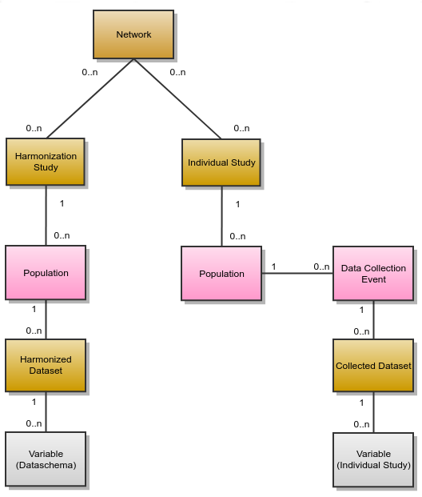

Documents
=========

Mica handles several type of documents, specific to the epidemiological studies domain: network, study, datasets etc. These document types have their own internal structure (to allow relationships between them and to ensure basic search), but can also be extended with custom fields. The default set of fields is the one promoted by `Maelstrom Research <https://maelstrom-research.org>`_. This default description model should fit with your needs in most of the cases.

All the documents follow the :doc:`publication-flow` except the :ref:`data-access-requests` (which is a form privately exchanged between a researcher and the study/consortium).

.. _document-types:

Types
-----

Network
~~~~~~~

A network is a group of epidemiological studies that has specific research interests. It is described using the following fields: name, aims, investigators, contact information and participating studies. It can also be related to other networks.

.. _individual-study-doc:

Individual Study
~~~~~~~~~~~~~~~~

An individual study is defined as any epidemiological study (e.g. cohort, case control, cross sectional, etc.) conducted to better understand the distribution and determinants of health and disease. It is described using the following fields: name, objectives, investigators, contact information, design, data collection timeline, target number and characteristics of participants, and related scientific publications and documents. A study can include one or more populations described below.

Population
^^^^^^^^^^

A population is a set of individuals sharing the same selection criteria for enrollment in a study. It is described using the following fields: name, sources of recruitment, participant characteristics, and number of participants. A population is linked to one or more data collection events according to the number of follow-ups.

Data Collection Event
^^^^^^^^^^^^^^^^^^^^^

A data collection event is a collection of information on one or more population(s) over a specific period of time (e.g. baseline, follow-up 1, follow-up 2). It is described using the following fields: name, start and end date, and data sources (e.g. questionnaires, physical measures, biosample measures, etc). A data collection event may be associated to one or more populations and it can include one or more datasets.

Harmonization Study
~~~~~~~~~~~~~~~~~~~

A harmonization study is defined as a research project harmonizing data across individual studies to answer specific reseach questions. It is described using the following fields: acronym, contact information, objectives, design and related documents. A harmonization study can include one population and one or more harmonized dataset (dataschema).

Population
^^^^^^^^^^

A population is a set of individuals sharing the same selection criteria for enrollment in the individual studies selected to create the harmonization study. It is described using the fields: name and description. A population is linked to one or more harmonized dataset.

Collected Dataset
~~~~~~~~~~~~~~~~~

A collected (study-specific) dataset holds metadata about the variables collected within a data collection event. The metadata is described using a standardized format of data dictionary which provides information on collected variables’ definitions and characteristics (e.g. type, unit, categories, and area of information covered). It can be associated to a study by specifying a data collection event.

Collected Variable
^^^^^^^^^^^^^^^^^^

A collected variable is a variable that was collected, measured, or constructed within a study protocol. It is described using the following fields: name, label, description, type, unit, categories, and area of information covered. If the collected dataset includes data, summary statistics of the collected variable can be published on the web portal (e.g. means, minimum, maximum, counts and percentages). Each collected variable is part of one and only one study-specific dataset.

Harmonized Dataset
~~~~~~~~~~~~~~~~~~

A harmonized dataset holds metadata about core variables constructed from multiple collected datasets. The metadata is described using a standardized format of data dictionary which provides information on harmonized variables’ definitions and characteristics (e.g. type, unit, categories, and area of information covered): this represent the data schema of the harmonized dataset. It can be optionally associated to the harmonized data.

Data Schema Variable
^^^^^^^^^^^^^^^^^^^^

A data schema variable is the harmonized dataset reference variable. Each harmonized variable will *implement* a corresponding data schema variable.

Harmonized Variable
^^^^^^^^^^^^^^^^^^^

A harmonized variable is a core variable (common format) generated by multiple individual studies. It is described using the following fields: name, label, description, type, unit, categories, and area of information covered. If the harmonized dataset includes data, summary statistics of the harmonized variable (e.g. means, minimum, maximum, counts and percentages) can be published on the web portal. Each harmonized variable is part of one and only one harmonized dataset.

Research Project
~~~~~~~~~~~~~~~~

A research project reports information about the work that was conducted thanks to the network/study data: research objectives and results, contact information, status timeline. It could be somehow related to a data access request but not necessarily.

.. _data-access-requests:

Data Access Request
~~~~~~~~~~~~~~~~~~~

A data access request is an application form that researchers submit in order to gain access to the network/study data. There is a predefined workflow from submission to approval described in more detail in :doc:`web-user-guide/data-access-request`.

Data Access Amendment
~~~~~~~~~~~~~~~~~~~~~

A data access amendment is an application form that researchers submit to request changes to a pre-approved data access request. The data access amendment workflow is identical to that of  data access requests.

Search
------

Mica search engine allows to look into the domain while applying criteria on each type of document. The result of this combined query can be of any type. For example:

* search for variables about alcohol, associated to studies having collected biosamples, and being part of a network
* search all studies having collected biosamples and having variables about alcohol, and being part of a network
* ...

Associations
------------

The following diagram describes the various documents that can be published in the Mica web portal. Each of them can be edited individually in the Mica Web Application administration interface (except variables, defined in the Opal servers).

.. _documents-permissions:

Permissions
-----------

Three types of permissions can be granted to a user. Each permission is defined by a user role each of which applies different level of restrictions on a document. The table below lists each role and corresponding restrictions:

======== ===========
Role     Description
======== ===========
Reader   Read-only access to the document in draft mode with its revisions and its associated files.
Editor   Edit access to the document in draft mode with its revisions and its associated files. Publication or permanent deletion are not permitted.
Reviewer Full access to the document, including its publication, permanent deletion and permissions.
======== ===========

Revision History
----------------

The revision history of a document is the succession of states after each edition (state refers to the content of the document, not its status). This history of changes allows to:

* view changes,
* reinstate a revision,
* identify which state is published.

Comments
--------

To enhance the collaboration between Mica users, each member can add a comment on any Mica domain document as well as data access requests documents. Mica can be configured to send email notifications when a comment is added or updated.

Cart
----

The cart groups a set of variables based on one or more search criteria. User can edit the cart by adding or removing variables, download its content (variables) as a CSV file and use it as a search criterion.
