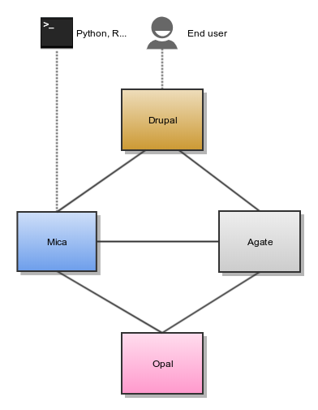

Introduction
============

Mica is an advanced web application designed to create data web portals for large-scale epidemiological studies or multiple-study consortia. It provides a structured description of consortia, studies, annotated and searchable data dictionaries, and data access request management.

Mica is built upon a multi-tier architecture consisting of several RESTful server and client applications. The table below list each application with a brief description:

.. list-table::
  :widths: 30 70
  :header-rows: 1

  * - Application
    - Description
  * - Mica Server
    - Java server providing web services (REST) for managing, storing, searching Mica Domain content and communicating with other servers listed below.
  * - `Opal Server <http://opaldoc.obiba.org>`_
    - Java server providing web services (REST) for importing, transforming and analyzing study variables.
  * - `Agate Server <http://agatedoc.obiba.org>`_
    - Java server providing web services (REST) for user management and notifications.
  * - :doc:`Mica Web Application </web-user-guide/index>`
    - Front-end to Mica Server providing client interface to manage Mica Domain content as well as to administrate and configure access permissions and secure connections.
  * - :doc:`Mica Drupal Client </drupal-user-guide/index>`
    - Extension of the Drupal Content Management System (CMS) allowing to build a web data portal with Mica's published content.
  * - :doc:`Mica Python Client </python-user-guide/index>`
    - Python front-end to Mica server providing services for administrative command-line and automation tasks.
  * - :doc:`Mica R Client </r-user-guide/index>`
    - R front-end to Mica server providing services for Mica content analysis and reporting.

The diagram below illustrates the relationships between the Mica server and the other tiers:

Mica Server
-----------

Editors and reviewers of the Mica web portal content can access to the web interface of this server as described in the Mica Web Application User Guide. Data access request form can also be configured through this web interface.

Mica server is a client of Opal and Agate servers.

Opal Server
-----------

Opal application is used for:

* defining data dictionaries (variables),
* storing data,
* providing data summary statistics.

Opal offers well established security controls, allowing to NOT expose individual-level data. Note also that the Opal server is only accessed by the Mica server, reducing the risk of data compromisation from a malicious end user.

Installation and configuration guides can be found in the `Opal documentation <http://opaldoc.obiba.org>`_.

Mica expects at least one Opal server when some datasets are defined. Additional Opal servers can also be identified to access to distributed datasets.

Agate Server
------------

Agate application is used for:

* having a user directory shared between OBiBa's applications,
* having centralized services such as profile management and email notifications.

Installation and configuration guides can be found in the `Agate documentation <http://agatedoc.obiba.org>`_.

Drupal Server
-------------

`Drupal <https://drupal.org>`_ is a content management system, i.e. an application allowing to build fully customizable web portals. Drupal can be extended by modules and themes: Mica and Agate modules have been developed to access to the services of these servers. Drupal server is therefore a client of Mica and Agate servers.

Installation and configuration guides about Drupal as a Mica client can be found in the Mica Drupal Client User Guide documentation.
