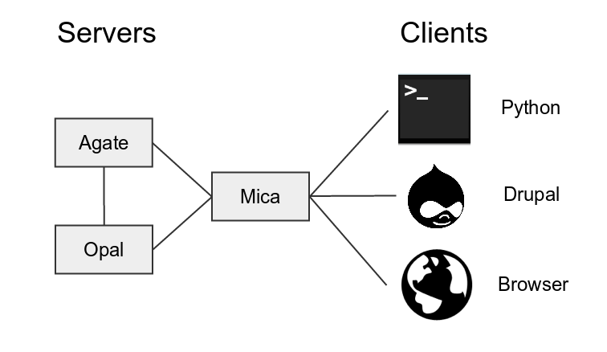

Introduction
============

Mica is an advanced web application designed to create data web portals for large-scale epidemiological studies or multiple-study consortia. It provides a structured description of consortia, studies, annotated and searchable data dictionaries, and data access request management.

Mica is built upon a multi-tier architecture consisting of several RESTful server and client applications. The table below list each application with a brief :

============================================= ======================================================
Application                                   Description
============================================= ======================================================
Mica Server	                                  Java server providing web services (REST) for managing, storing, searching Mica Domain content and communicating with other servers listed below.
`Opal Server <http://opaldoc.obiba.org>`_	    Java server providing web services (REST) for importing, transforming and analyzing study variables.
`Agate Server <http://agatedoc.obiba.org>`_   Java server providing web services (REST) for user management and notifications.
Mica Web Application                          Front-end to Mica Server providing client interface to manage Mica Domain content as well as to administrate and configure access permissions and secure connections.
Mica Drupal Client                            Extension of the Drupal Content Management System (CMS) allowing to build a web data portal with Mica's published content.
Mica Python Client                            Python front-end to Mica server providing services for administrative command-line and automation tasks.
============================================= ======================================================

The diagram below illustrates the relationships between the Mica server and the other tiers:

