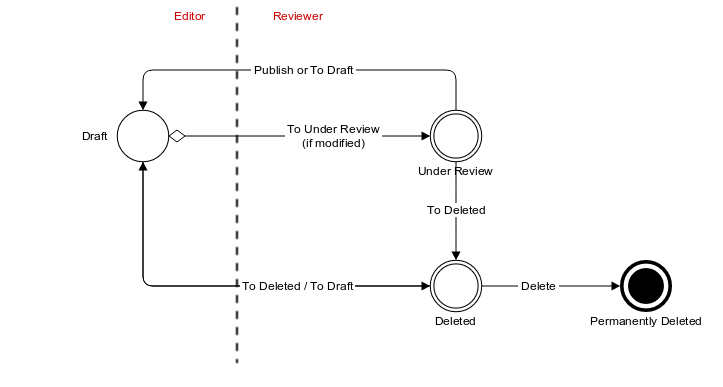

Publication Flow
================

Documents (and their associated files) are all publishable documents (except Data Access Requests). Being a publishable document means that there can be different revisions of the document before being published.

The publication flow refers to the work flow from a draft document to its publication. The following diagram represent the life cycle of a document with its Revision Status and Transitions:

Revision Status
---------------

The publishable document goes through several states allowing to separate user privileges: some users will be responsible for the content edition only, while other users will be responsible for the reviewing and the publication of the document.

A draft document can be changed/edited as many times as necessary. When the edition work is done, the document is staged for being reviewed. The state of the document that is reviewed is the one that will be published. Once the review and the publication is done, the document is ready again for edition. When a document is to be removed, it is first marked as being deleted (without affecting the publication) before being permanently removed.

The revision status is an enumeration of named states:

+------------------+----------------------------------------------------------------------+-----------------------------+-----------------------------+-----------------------------+----------------+----------------+
| Status           | Description                                                          | Editable                    | Publishable                 | Deletable                   | From Status    | To Status      |
+==================+======================================================================+=============================+=============================+=============================+================+================+
| ``Draft``        | | The document is in the editable state.                             | .. image:: images/check.png | .. image:: images/error.png | .. image:: images/error.png | - Under Review | - Under Review |
|                  | |                                                                    |                             |                             |                             | - Deleted      | - Deleted      |
|                  | | This state requires lesser privileges: the document cannot be      |                             |                             |                             |                |                |
|                  | | published nor deleted, it can only be staged for these operations. |                             |                             |                             |                |                |
+------------------+----------------------------------------------------------------------+-----------------------------+-----------------------------+-----------------------------+----------------+----------------+
| ``Under Review`` | | Staged for reviewing, allowing user with higher privileges to      | .. image:: images/error.png | .. image:: images/check.png | .. image:: images/error.png | - Draft        | - Draft        |
|                  | | approve and perform publication. The document is not editable and  |                             |                             |                             |                | - Deleted      |
|                  | | it can be published.                                               |                             |                             |                             |                |                |
|                  | |                                                                    |                             |                             |                             |                |                |
|                  | | Once published it automatically goes back to the Draft status. If  |                             |                             |                             |                |                |
|                  | | the changes are not approved, the status can be switch to Draft    |                             |                             |                             |                |                |
|                  | | without affecting the publication.                                 |                             |                             |                             |                |                |
+------------------+----------------------------------------------------------------------+-----------------------------+-----------------------------+-----------------------------+----------------+----------------+
| ``Deleted``      | | Staged for permanent deletion. The document is not editable, nor   | .. image:: images/error.png | .. image:: images/error.png | .. image:: images/check.png | - Draft        | - Draft        |
|                  | | publishable. Being published does not prevent a document from      |                             |                             |                             | - Under Review |                |
|                  | | going into the Deleted state: the un-publication will be effective |                             |                             |                             |                |                |
|                  | | when the deletion is permanent. Note also that the document can be |                             |                             |                             |                |                |
|                  | | un-published at any time.                                          |                             |                             |                             |                |                |
+------------------+----------------------------------------------------------------------+-----------------------------+-----------------------------+-----------------------------+----------------+----------------+

Transitions
-----------

The transitions between the different revision status are the following:

+---------------------+----------------------------------------------------------------------+------------------------------+----------------+----------------+
| Transition          | Description                                                          | Permission                   | From Status    | To Status      |
+=====================+======================================================================+==============================+================+================+
| *To Under Review*   | Once changes have be saved, the document is ready to be reviewed.    | - Edit                       | - Draft        | - Under Review |
|                     |                                                                      | - Review                     |                |                |
+---------------------+----------------------------------------------------------------------+------------------------------+----------------+----------------+
| *To Draft*          | | If reviewed changes or the deletion are rejected, the document     | - Edit                       | - Under Review | - Draft        |
|                     | | can return to the draft state for edition.                         | - Review                     | - Deleted      |                |
+---------------------+----------------------------------------------------------------------+------------------------------+----------------+----------------+
| *Publish*           | | When changes have been reviewed and approved, the document can be  | - Review                     | - Under Review | - Draft        |
|                     | | published: the current state of the document is persisted in the   |                              |                |                |
|                     | | publication repository.                                            |                              |                |                |
+---------------------+----------------------------------------------------------------------+------------------------------+----------------+----------------+
| *To Deleted*        | Approval for document deletion is requested.                         | - Edit                       | - Draft        | - Deleted      |
|                     |                                                                      | - Review                     |                |                |
+---------------------+----------------------------------------------------------------------+------------------------------+----------------+----------------+
| *Delete*            | | Deletion is approved and effective. If the document was published, | - Review                     | - Deleted      |                |
|                     | | it is removed from the publication repository.                     |                              |                |                |
+---------------------+----------------------------------------------------------------------+------------------------------+----------------+----------------+
