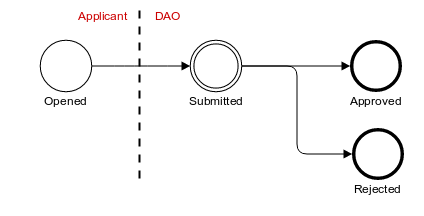
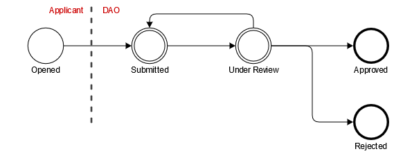
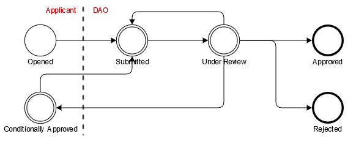

Data Access Requests Management
===============================

Summary
~~~~~~~

Before requesting access to data, a researcher needs to register by sending a
*data access request*.

Request Workflow
~~~~~~~~~~~~~~~~

To create a data access request, users have to fill out the application form
and *submit* it once it is completed. The *validate* button can be used to
check that the form contains the required information. Before submitting
he request, the form can be edited and saved (for future edits) as needed.
After the request is submitted, the form is frozen and can no longer be
edited unless the request is reopened.

After the request is submitted, a data access officer will *review* it in order
to *approve* or *reject* it. The data access officer can also *reopen* (or
*conditionally approve*) the request if he considers that modifications are
needed. This workflow, as well as email notifications that can be sent on
request status changes, can be configured by the administrator, e.g. to omit
the *review* step or make the *approve*/*reject* steps final.

The most simple workflow is:

* no ``Under Review`` intermediate state
* no ``Conditionally Approved`` intermediate state
* ``Approved`` state is final
* ``Rejected`` state is final

When the ``Under Review`` intermediate state is activated (which is the default
configuration), the flow is:

When the ``Conditionally Approved`` intermediate state is activated, the flow
is:

.. image:: ../images/mica-dar-conditionally-approved-flow.png

When both ``Under Review`` + ``Conditionally Approved`` intermediate states are
activated, the flow is:

The workflow is resumed in the following table:

.. list-table::
  :widths: 15 55 15 15
  :header-rows: 1

  * - Status
    - Description
    - From Status
    - To Status
  * - Opened
    - The request is in an editable state.
    -
    - Submitted
  * - Submitted
    - | The request is submitted to the application officer and is not editable by the applicant.
      |
      | The application officer can (conditionally) approve or reject it or, if configured, go to an intermediate under review status.
    - Opened
    - | Under Review
      | or

      * Approved
      * Rejected
  * - Under Review
    - | The request is being reviewed by the application officer. He can reopen, conditionally approve (if this state is activated), approve or reject the request.
    - Submitted
    - * Opened
      * Approved
      * Rejected
      * Conditionally Approved
      * Submitted
  * - Approved
    - | The request has been approved. If configured, the request can go back to the submitted or reviewed status.
    - | Submitted
      | or
      | Under Review
    - | if state is not final:
      |
      | Submitted
      | or
      | Under Review
  * - Rejected
    - | The request has been rejected. If configured, the request can go back to the submitted or reviewed status.
    - | Submitted
      | or
      | Under Review
    - | if state is not final:
      |
      | Submitted
      | or
      | Under Review
  * - Conditionally Approved
    - | The request was submitted, has been reviewed and some adjustments are required before a final approval.
      |
      | The applicant can edit its request and will re-submit it.
    - | Submitted
      | or
      | Under Review
    - Submitted

Application form
~~~~~~~~~~~~~~~~

The application form is configured by the administrator, who can also define
the PDF template used to create a printable copy of the form (available by
clicking on the *Download* button).

Comments
~~~~~~~~

At any step, the user and the data access officer can add comments in order to
collaborate.

History
~~~~~~~

A *history* of all actions performed on the request is kept to track its
status.
